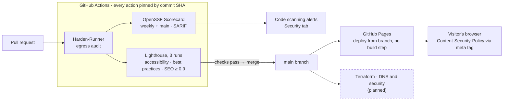
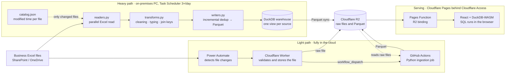
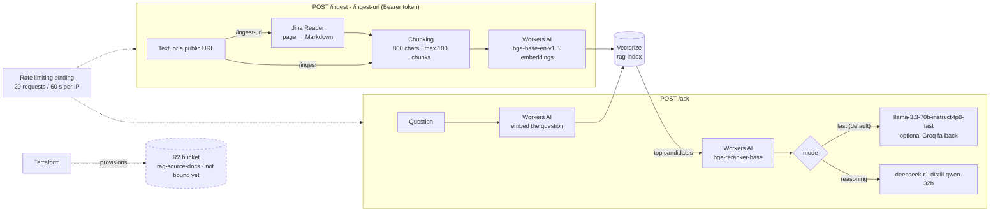

# juanberrio0399.github.io

Interactive portfolio of **Juan Berrio** — Cloud & Data Engineer.

🔗 Live: https://juanberrio0399.github.io

Static site (HTML + CSS + vanilla JS): project tabs, scroll-reveal animations, a print-to-PDF
version for recruiters and an EN/ES language toggle. No build step — served directly by GitHub Pages.

## 🏗️ Architecture (diagrams as code)

The diagrams below are [Mermaid](https://mermaid.js.org/) source that GitHub renders natively, so they
live next to the code, are reviewed in pull requests like any other change and never go stale as
committed images. Each one describes what the project actually runs today; anything that is planned,
or exists but is not wired in yet, is drawn with a dashed border and says so.

### This site

### DataForge — Excel to a serverless dashboard

Client code is private; this is the anonymized architecture described in the
[case study](https://github.com/juanberrio0399/portfolio/blob/main/case-studies/01-dataforge-customs-reconciliation_EN.md).

### Serverless RAG Assistant

Source: [serverless-rag-assistant](https://github.com/juanberrio0399/serverless-rag-assistant) — a single
Cloudflare Worker whose bindings are declared in `wrangler.jsonc`.

## 🔒 Security

Actions are pinned by commit SHA, workflows run with least-privilege `permissions:` and
Dependabot opens one grouped pull request a week so those pins do not go stale. OpenSSF
Scorecard scores the supply-chain posture weekly and uploads its SARIF to code scanning.
How to report a vulnerability: [SECURITY.md](SECURITY.md).

## 🔮 Roadmap Técnico

Próxima fase: Migración a despliegue automatizado mediante GitHub Actions y gestión de DNS/Seguridad mediante Terraform para reflejar prácticas reales de Cloud Engineering.
