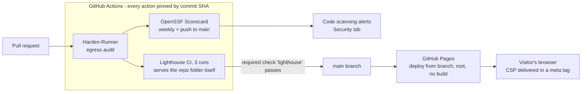
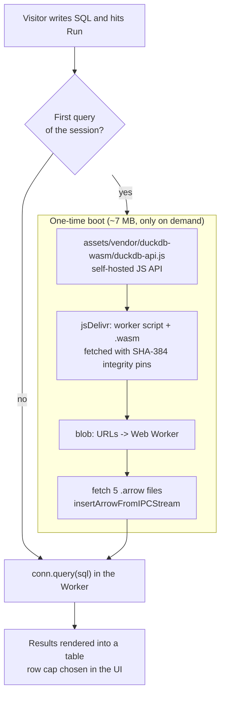

# juanberrio0399.github.io

[](https://github.com/juanberrio0399/juanberrio0399.github.io/actions/workflows/lighthouse.yml)
[](https://scorecard.dev/viewer/?uri=github.com/juanberrio0399/juanberrio0399.github.io)

Source of <https://juanberrio0399.github.io> — the portfolio of Juan Berrio, Cloud & Data Engineer.

## What this is

A three-page static site (portfolio, SQL playground, 404) written in HTML, CSS and vanilla
JavaScript, served by GitHub Pages straight from `main`. There is no framework, no bundler and no
build step: what is committed is what is served.

Two things it has to do beyond looking presentable:

- **Answer a recruiter in one page.** EN/ES toggle, project tabs, and a print stylesheet so
  `Download Portfolio (PDF)` is just `window.print()` — no PDF to keep in sync with the site.
- **Show the work instead of describing it.** [`playground.html`](playground.html) runs real SQL
  over a snapshot of Juan's public GitHub activity using DuckDB-WASM, in the visitor's browser.
  It is the same local-first pattern used in the DataForge dashboards, small enough to read.

## How it works

### Site and delivery



Pages is configured as *deploy from branch* (`main`, `/`), so a merge is the deploy. `.nojekyll`
switches off Jekyll processing, which would otherwise ignore any path starting with an underscore
and add a build step for nothing.

Pages cannot send response headers, so the Content-Security-Policy travels in a
`<meta http-equiv>` tag in every page. The base policy is `default-src 'none'` plus the few hosts
actually used (Google Fonts for CSS and font files). `playground.html` ships a wider policy of its
own because WebAssembly needs it — see below.

### Playground



Nothing about the engine loads with the page: the 7 MB download happens on the first `Run`, so a
visitor who never runs a query pays for a normal HTML page. The worker and `.wasm` come from
jsDelivr but are fetched with `fetch(..., { integrity })` against SHA-384 hashes pinned in
[`assets/js/playground.js`](assets/js/playground.js), then started from `blob:` URLs — a swapped
CDN file fails to load instead of running. Known DuckDB extensions are disabled
(`autoinstall_known_extensions = false`) so a query can never pull code from a third host at
runtime.

The data is five Apache Arrow IPC files (~28 KB in total: 7 repos, 12 language rows, 77 commit-days,
154 pull requests, 1 snapshot row taken 2026-09-15). Arrow rather than Parquet because DuckDB-WASM
ingests Arrow natively, while Parquet would make the browser fetch the parquet extension at runtime.

Architecture diagrams for the projects the site talks about (DataForge, the Serverless RAG
Assistant) live in [docs/project-architecture.md](docs/project-architecture.md).

## Repository structure

| Path | What lives there |
|---|---|
| `index.html` | The portfolio itself: profile, skills, project tabs, contact. Includes JSON-LD and the per-page CSP. |
| `playground.html` | The SQL playground page: presets, editor, table schemas, and its own wider CSP. |
| `404.html` | Served by Pages for any unknown path; uses root-absolute asset paths for that reason. |
| `assets/js/main.js` | Portfolio behaviour: language toggle, project tabs, scroll reveal, print. No inline handlers, so the CSP needs no `'unsafe-inline'`. |
| `assets/js/playground.js` | Engine boot, SRI pins, preset queries, EN/ES messages, result rendering. |
| `assets/css/` | `main.css` (site + print rules), `playground.css`, `404.css`. |
| `assets/vendor/duckdb-wasm/` | Self-hosted DuckDB-WASM JS API (~215 KB, built by the vendor script) and its third-party notices. |
| `assets/data/playground/*.arrow` | The committed snapshot the playground queries. |
| `scripts/playground/build_data.py` | Rebuilds those Arrow files from the public GitHub REST API. |
| `scripts/playground/vendor_duckdb.sh` | Rebuilds `duckdb-api.js` and prints the SHA-384 hashes to paste into `playground.js`. |
| `.github/workflows/` | `lighthouse.yml` (quality gate on every PR), `scorecard.yml` (supply-chain score). |
| `.github/dependabot.yml` | Weekly grouped bump of the pinned action SHAs. |
| `.lighthouserc.json` | Which URLs Lighthouse audits and the score thresholds it enforces. |
| `SECURITY.md` | Scope of the project and how to report a vulnerability. |
| `robots.txt`, `sitemap.xml`, `og-image.png`, `favicon.svg`, `.nojekyll` | Indexing, social preview and the Jekyll opt-out. |

## Running it locally

Any static file server works; the pages use relative paths (`404.html` does not, by design).

```sh
python -m http.server 8000
# http://localhost:8000/  and  http://localhost:8000/playground.html
```

Opening the files with `file://` does not work: `playground.js` is an ES module and the Arrow
fetches are same-origin.

Refresh the playground snapshot (writes into `assets/data/playground/`):

```sh
pip install duckdb pyarrow
GITHUB_TOKEN=$(gh auth token) python scripts/playground/build_data.py
```

The token is optional — it only raises the GitHub API rate limit. The run above took a few minutes
and printed a row count per table.

Re-vendor the DuckDB-WASM API after bumping the engine version (needs `npm` and `openssl`):

```sh
sh scripts/playground/vendor_duckdb.sh
```

It rewrites `assets/vendor/duckdb-wasm/duckdb-api.js` and prints the four SHA-384 lines to copy
into the `SRI` map in `assets/js/playground.js`; `ENGINE_VERSION` there and the versions in
`THIRD_PARTY_NOTICES.txt` have to move in the same commit.

Run the quality gate the way CI does (needs Chrome):

```sh
npx --yes @lhci/cli autorun --config=.lighthouserc.json
```

## Decisions and limits

- **No framework, no build step.** The site is a few hundred lines of markup; a bundler would add a
  toolchain to maintain and a class of deploy failures for no gain. It also keeps the Pages setup
  at *deploy from branch*, so there is no way for a "built" site to drift from the sources.
- **CSP in a meta tag.** Not as strong as a header (it cannot carry `frame-ancestors` or a report
  endpoint), but it is the only option Pages offers, and it still blocks inline script, unexpected
  hosts and form posts. Adding an external asset means editing the policy in every page.
- **The engine loads on the first query, not on page load.** The playground exists to be tried, not
  to be downloaded; deferring the 7 MB is what keeps the page's Lighthouse performance score in the
  same range as the portfolio page.
- **The engine is pinned and integrity-checked rather than fully self-hosted.** The `.wasm` files
  are too large to keep in Git for a Pages site; hashes give the same guarantee without the weight.
  Only the small JS API is committed.
- **The snapshot is committed data, not a live API call.** The playground shows what the repository
  contains; it does not call GitHub at runtime, so it works offline once the engine is cached and
  cannot leak a token.
- **What this project is not.** No backend, no database, no analytics, no cookies, no forms and no
  user input leaving the browser. Nothing here is a general-purpose SQL service: the dataset is
  fixed at ~28 KB and lives entirely in the visitor's memory.

## Operation

| What runs | When | Where its output lands |
|---|---|---|
| Lighthouse CI | every PR, every push to `main`, manual dispatch | The check named `lighthouse`, plus an uploaded HTML report (temporary public storage) |
| OpenSSF Scorecard | Tuesdays 06:17 UTC, pushes to `main`, PRs touching `.github/**` | SARIF in the Security tab (code scanning) and the badge above |
| Dependabot | Tuesdays, one grouped PR | A `ci:` PR that moves the pinned action SHAs and their version comments |
| GitHub Pages | on every push to `main` | <https://juanberrio0399.github.io> |

`main` is protected: a pull request cannot merge until the `lighthouse` check passes, and the
branch must be up to date first.

When something fails:

- **Lighthouse red.** Accessibility, best practices and SEO are hard failures below 0.9;
  performance only warns. Open the report linked in the job log — it names the failing audit.
  Thresholds live in `.lighthouserc.json`, the audited URLs too.
- **The playground stops loading.** Almost always the pinned engine: if jsDelivr serves a file whose
  hash does not match the `SRI` map, the fetch fails and the page shows the "integrity check"
  message. Re-run the vendor script for the pinned version and compare hashes before changing them.
- **Scorecard drops.** The score reacts to unpinned actions, missing permissions blocks and stale
  dependencies. The SARIF entry in the Security tab points at the file and line.

## Current state and next steps

Working: both pages, the playground end to end (verified locally against the committed snapshot),
the two CI workflows, Dependabot, and the security policy.

Not done yet:

- The snapshot is refreshed by hand. Until `build_data.py` runs on a schedule, the playground data
  ages — the `snapshot` table is there so a visitor can see exactly how old it is.
- DNS and security settings are managed in the GitHub UI. Moving them to Terraform is the intended
  next step and is the only reason a deploy workflow would be worth adding.
- Open ideas tracked as issues: scroll-driven CSS animations (#3), the Speculative Rules API (#34),
  and a larger remote-attach playground (#36).
