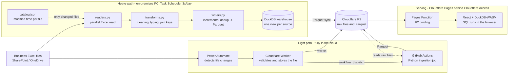
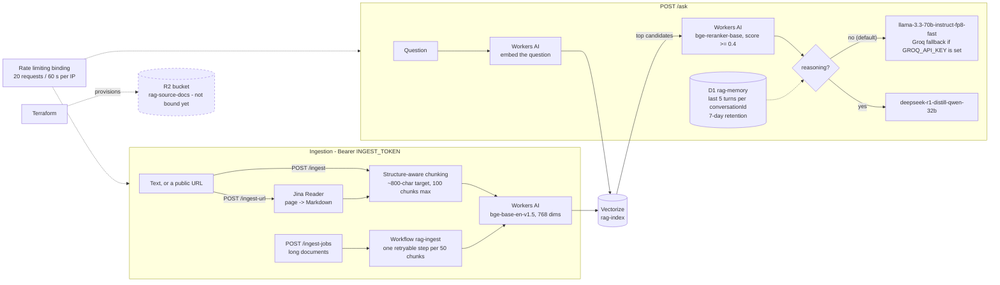

# Architecture of the projects the site describes

The portfolio page summarises two systems in a few lines each. This file carries the diagrams
behind those summaries, as [Mermaid](https://mermaid.js.org/) source so GitHub renders them and a
pull request reviews them like any other change — a committed PNG would have gone stale silently.

Anything planned, or present but not wired in, is drawn with a dashed border and says so.

The architecture of this repository (the site and the SQL playground) is in the
[README](../README.md).

## DataForge — business Excel files to a serverless dashboard

Client code is private. This is the anonymized architecture described in the
[case study](https://github.com/juanberrio0399/portfolio/blob/main/case-studies/01-dataforge-customs-reconciliation_EN.md).
The heavy path reads the courier's Excel exports on a PC because doing that volume in the cloud
would cost money; the light sources never touch that machine.

The cloud steps of the daily run are deliberately non-critical: if the R2 sync fails the local
warehouse is still correct and the run reports which step was skipped.

## Serverless RAG Assistant

Source: [serverless-rag-assistant](https://github.com/juanberrio0399/serverless-rag-assistant) — one
Cloudflare Worker whose bindings (Workers AI, Vectorize, D1, Workflows, rate limiting) are declared
in `wrangler.jsonc`.

Ingestion is closed unless the `INGEST_TOKEN` secret exists — without it `/ingest` and
`/ingest-url` answer 503 rather than accepting anonymous documents. The `ask:` and `ingest:` rate
limits are counted separately, so ingesting does not lock a visitor out of asking.
